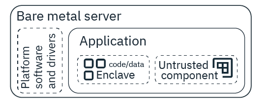

---

copyright:
  years: 2018, 2020
lastupdated: "2020-03-04"

keywords: provision, sgx, provision server Intel SGX architecture, Intel SGX architecture, confidential computing,

subcollection: bare-metal

---

{:shortdesc: .shortdesc}
{:codeblock: .codeblock}
{:screen: .screen}
{:new_window: target="_blank"}
{:pre: .pre}
{:table: .aria-labeledby="caption"}
{:tip: .tip}

# Building a bare metal server with Intel Software Guard Extension architecture
{: #bm-server-provision-sgx}

Intel Software Guard Extensions (SGX) is a technology that can protect data that is in use through hardware-based server security. With Intel SGX apps, you can protect select code and data from disclosure or modification. Through the use of trusted execution environments (TEE), known as enclaves, you can encrypt the pieces of your app memory that contain sensitive data while it is being used.
{: shortdesc}

{: caption="Figure 1. Example SGX application set up" caption-side="bottom"}

When you're developing a confidential computing application, you must design it in a way that you can segment the information that needs to be encrypted. At runtime, the segmented information is kept confidential through a process that is known as attestation. When communication occurs with the segmented code or app data, the enclave verifies that it is coming from the other part of the application before sharing any information with it. Through the attestation process, information is kept confidential and data leakage is prevented.

Don't have an app that's configured to use Intel SGX but you still want to take advantage of the technology? Try using [IBM Cloud Data Shield](/docs/data-shield?topic=data-shield-getting-started).
{: tip}

## Provisioning a server
{: #provision-sgx}

Ready to get started with Intel SGX on bare metal? Provision a server.

[Build a custom bare metal server](/docs/infrastructure/bare-metal?topic=bare-metal-ordering-baremetal-server) by using the following information as a guide for your order form.

|Section|Option to select|
|------|------|
|Server|Single processor,<br> Intel Xeon E3-1270 v6 with Storage up to four drives|
|Image|Windows Server 2016 Standard Edition (64 bit)<br>Windows Server 2016 Standard Edition (64 bit)<br> Windows Server 2016 Datacenter Edition (64 bit) <br>CentOS 7.x (64 bit) <br>Ubuntu Linux 16.04 LTS Xenial Xerus (64 bit)<br>- CentOS 7.x (64 bit) <br>Red Hat Enterprise Linux 7.x (64 bit) (per-processor licensing)|
|Image Add-ons|Software Guard Extensions|
  
  
## Installing Intel SGX plaform software and drivers on Windows systems
{: #install-intel-windows}

When you're working with Intel SGX enabled bare metal servers, be sure that you also intall the SGX platform software and drivers. If you're using a Linux system, skip to the next section. 

1. Go to the [Intel Open Source website](https://01.org/intel-software-guard-extensions/downloads){: external} and select the option for installation that matches your operating system.
2. From the options that are provided, select the binary installation option. This ensures that you're using a stable version of SGX in your workloads.
3. For specific instructions for each type of installation, see the [Intel SGX Installation Guide for windows](https://downloadcenter.intel.com/product/80895/Intel-Software-Guard-Extensions-Intel-SGX-for-Windows-){: external}.


## Installing Intel SGX platform software and drivers on Linux systems
{: #install-intel-linux}

If you're working on a Linux system, you can use a script to install the SGX platform software and drivers.

1. After your server is provisioned, go to the **Classic Infrastructure** section of the IBM Cloud dashboard. Expand the details for the server that you created and get the public IP and password that is shown.

2. In terminal, run the following command to sign in to your server. After you run the command, you are prompted for your password.

  ```
  ssh root@<public-ip>
  ```
  {: codeblock}

3. Run the following command to install the Intel SGX driver and SGX platform software.

  ```
  curl -fssl https://raw.githubusercontent.com/ibm-cloud-security/data-shield-reference-apps/master/scripts/sgx-driver-psw/install_sgx/install_sgx.sh | bash
  ```
  {: codeblock}
